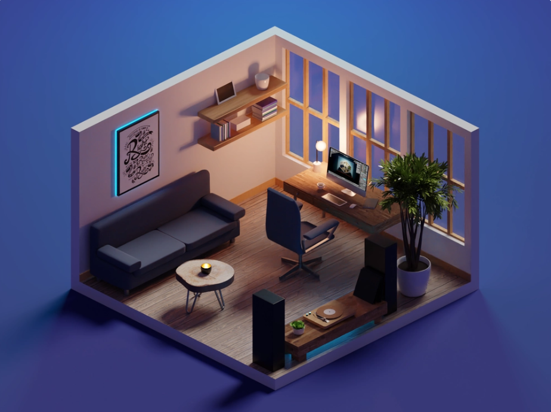

# Interactive 3D room scene

Challenge inspired by Roman Klčo's 3D illustration design [Room inspiration in Dribbble](https://dribbble.com/shots/7220175-Night-Shift). This challenge aims to improve 3D design skills using Spline's app with its tools by discovering new web technologies.



## Table of contents

- [Overview](#overview)
  - [The challenge](#the-challenge)
  - [Built with](#built-with)
- [My process](#my-process)
  - [What I learned](#what-i-learned)
  - [Continued development](#continued-development)
  - [Useful resources](#useful-resources)
- [Author](#author)
- [Contribution](#contribution)

## Overview

### The challenge

Users should be able to:

- Change the rotation of the scene through the default orthographic camera.
- Click on the computer's screen and interact with it.
- **Bonus**: Interact with items of the room for animations.

### Built with

- [Solidjs](https://www.solidjs.com/) - JS library
- [Vitejs](https://vitejs.dev/) - Next generation frontend tooling
- [Typescript](https://www.typescriptlang.org/) - Typed JS language
- [SASS](https://sass-lang.com/) - Powerful grade CSS extension
- [Spline](https://spline.design/) - A place to design and collaborate in 3D

## The process

### What I learned

Vite is blazingly fast when it comes to running a server, thanks to the bundler [esbuild](https://esbuild.github.io/).

No function will be called in a component with state changes with the `createSignal` method, which only keeps track of the state itself.

```js
const [counter, setCounter] = createSignal(0);
setInterval(setCounter, 1000, (c: number) => c + 1);

return <h1 class="header">{counter()}</h1>;
```

### Continued development

Getting to know more about solid's possibilities rather than depending on react. SPA should be built using Next.js, but for quick learning projects, Vite might be the best option.

### Useful resources

- [Example resource 1](https://www.example.com) - This helped me for XYZ reason. I liked this pattern and will use it going forward.
- [Example resource 2](https://www.example.com) - This is an amazing article that helped me finally understand XYZ. I'd recommend it to anyone still learning this concept.

## Contribution

If you'd like to contribute, you'll have to make a copy of the `.env` file and rename it to `.env.local`.

## Author

- Website - [Walid Korchi](https://www.walidkorchi.com/)
- Discord - Walidoux#3152
